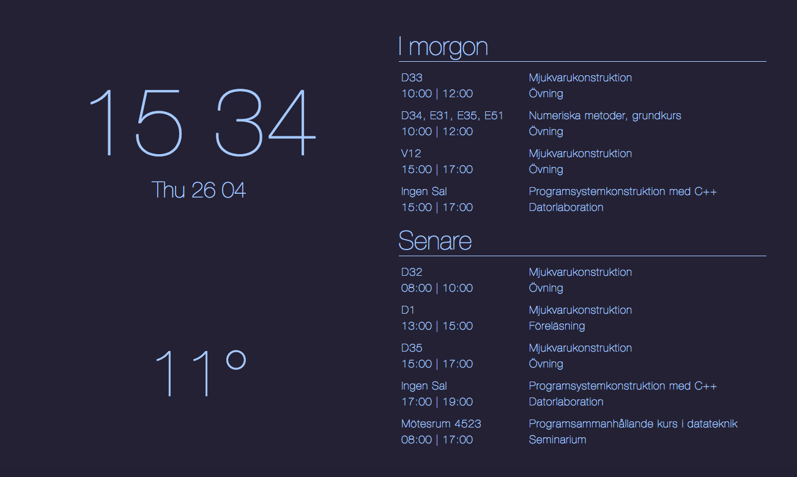

# NewTab
NewTab is a chrome extension which overrides the new tab page. It displays the following:
- Time and date
- Current temperature (using [Open Weather Map's API](https://openweathermap.org/api))
- Your google calendar (using [google's calendar api](https://developers.google.com/calendar/))

## Screenshot

