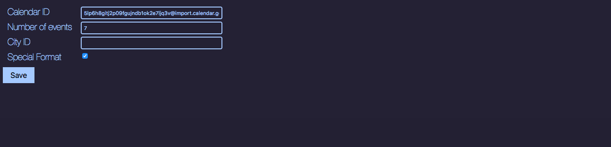

# NewTab
NewTab is a chrome extension which overrides the new tab page. It's written in react and all components are done from scatch, i.e no component library was used. The formatting of the calendar is quite specific for my exact calendar.

It displays the following:
- Time and date
- Current temperature (using [Open Weather Map's API](https://openweathermap.org/api))
- Your google calendar (using [google's calendar api](https://developers.google.com/calendar/)).  The user currently logged into chrome is the one authenticated.

# Main page

## Options page

